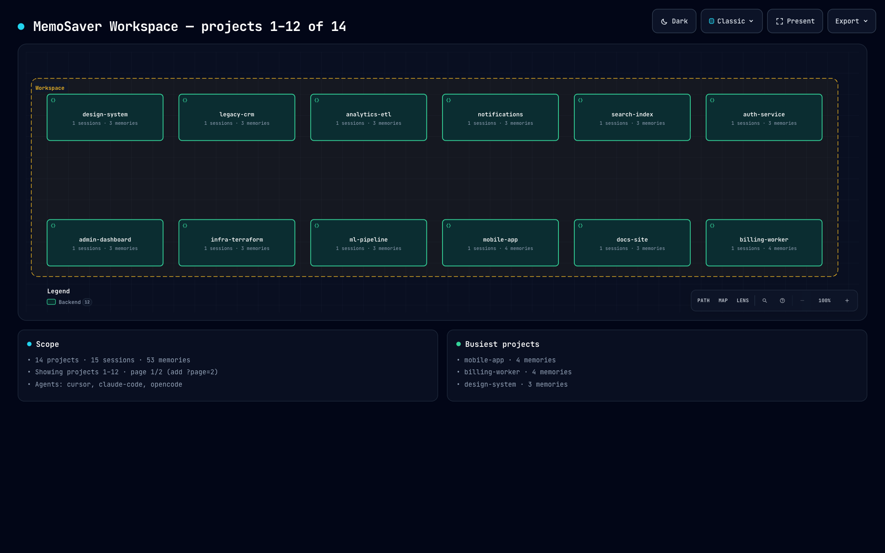
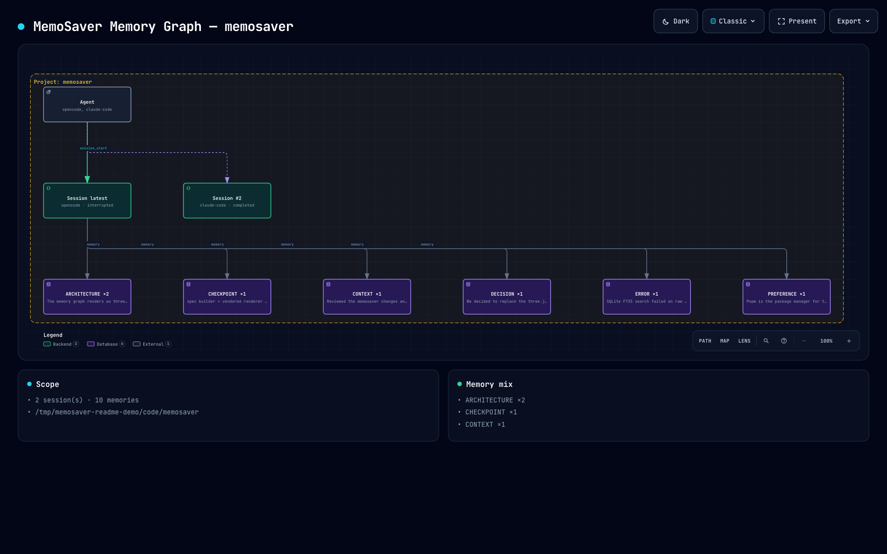
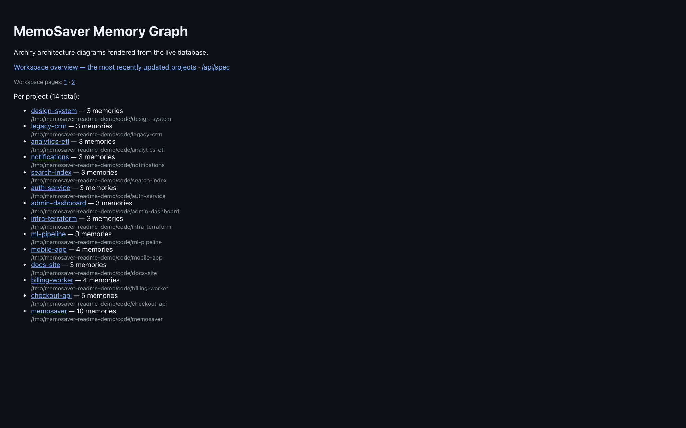

<div align="center">


# MemoSaver

**Local-first, persistent memory & session continuity for AI coding agents.**


[](https://modelcontextprotocol.io)

> **Never start your AI session from zero.**

<a href="assets/screenshots/workspace-overview.png">
  
</a>

<sub>`memosaver visual` — every project as an Archify architecture diagram, rendered from your local SQLite memory.</sub>

</div>

MemoSaver is an MCP server that lives **outside** Claude Code / OpenCode session lifecycles. It detects the project you open, captures the decisions, errors, solutions and progress that matter, stores them in a local SQLite database — and days later hands your agent a **resume context** so you can say *"continue where we left off"* without re-explaining anything.

```text
Monday   cd project-a && claude   → session_start → work → memories + checkpoint → session_end
Friday   cd project-a && claude   → session_start → resume context → straight back to work
```

## Why MemoSaver?

AI agents forget everything the moment a session ends. You end up re-explaining your architecture, your decisions, and what's still pending — every single time. MemoSaver keeps the **knowledge that matters** (not the transcript), bind to your **project**, on your **own machine**, independent of which agent you use.

## Features

| | |
|---|---|
| 📁 Project detection | deterministic `sha256(path)` ids; same folder = same project |
| 🧠 Sessions | `active` / `completed` / `interrupted`, auto-close on re-open |
| ⚡ Auto memory | 10-type classifier, importance scoring, dedupe, buffered extraction |
| 🔎 Search | FTS5 (BM25) keyword search + optional **hybrid** token-overlap ranking |
| 🧰 Checkpoints | manual + automatic; token-budgeted resume context (~2–5k tokens) |
| 🤖 Agent-agnostic | Claude Code, OpenCode, cursor, and any MCP-capable agent |
| 🔒 Local-first | zero cloud, zero network, zero native deps — your data is yours |
| 🖼 Archify diagram | live memory graph as a self-contained Archify architecture diagram (`memosaver visual`) |
| 🛡 Graceful failure | MemoSaver enhances; it never blocks or crashes the agent |

## Requirements

- **Node.js >= 22.5** (uses the built-in `node:sqlite` — no native compilation, no install step)

## Quick start

```console
git clone <your-repo-url>/memosaver
cd memosaver
pnpm install && pnpm build
npm link            # registers `memosaver` and `memosaver-mcp`
```

Verify:

```bash
memosaver doctor
```

## Connect as MCP

### Claude Code

> The [CLI command](https://docs.anthropic.com/en/docs/claude-code/mcp) adds it to `~/.claude.json`. Scope **user** to make it available in every project:

```bash
claude mcp add memosaver --scope user -- node /path/to/memosaver/dist/mcp/entry.js
```

### OpenCode

Add to `~/.config/opencode/opencode.json`:

```json
{
  "mcp": {
    "memosaver": {
      "type": "local",
      "enabled": true,
      "command": ["node", "/path/to/memosaver/dist/mcp/entry.js"]
    }
  }
}
```

> There used to be a `"type": "stdio"` variant in older docs — OpenCode now expects the `local` shape above.

### Any MCP client

Run the server binary directly over stdio:

```bash
node /path/to/memosaver/dist/mcp/entry.js
```

and point your client at it as a **stdio/local** server (most clients mirror either the Claude Code or OpenCode shape above).

## Usage in chat

Start a session, work, checkpoint, close — then resume later:

```text
● Start:      "Start a MemoSaver session for this project."
● Capture:    "Save this to MemoSaver: <decision/error/solution>"
● Checkpoint: "Checkpoint: completed=..., pending=..., next_action=..."
● Close:      "Finish the MemoSaver session."
● Resume:     "Continue from where we left off (use MemoSaver memory)."
```

`session_start` automatically returns a resume context whenever the project has prior memory.

## MCP tools

| Tool | Purpose |
| --- | --- |
| `session_start` | open a project; returns resume context if a previous session exists |
| `session_checkpoint` | record goal, current state, completed, pending, blockers, next |
| `session_end` | close a session (`completed`/`interrupted`); auto final checkpoint |
| `session_status` | inspect sessions |
| `session_timeline` | chronological checkpoints + memories of a session |
| `memory_insert` | explicitly persist a memory |
| `memory_update` | edit content / type / importance of a memory |
| `memory_recall` | top memories by importance |
| `memory_search` | FTS5 BM25 keyword search |
| `memory_search_hybrid` | BM25 + lexical token-overlap ranking |
| `memory_delete` | remove a memory |
| `memory_capture` | run extraction immediately on raw text |
| `memory_export` / `memory_import` | portable JSON backup / restore |
| `activity_log` | buffer one raw event for automatic extraction |

## CLI reference

```bash
memosaver status                          # storage + counts
memosaver projects                        # all known projects
memosaver sessions [project_path]         # sessions
memosaver session <id> [--end|--interrupt|--timeline]

# memories
memosaver memory list --project <path>
memosaver memory search "jwt auth" --project <path>
memosaver memory search "jwt" --project <path> --hybrid
memosaver memory save "postgres chosen for JSONB" --project <path>
memosaver memory update <id> --type DECISION
memosaver memory recall --project <path>
memosaver memory delete <id>
memosaver memory export --project <path> --out memories.json
memosaver memory import memories.json

# memory graph diagram
memosaver visual [--project <id|path|name>] [--page <n>] [--limit 1-12] [--port 8888] [--no-open]

# diagnostics
memosaver doctor
```

## Memory graph diagram

Explore your memory graph in the browser:

```bash
memosaver visual                        # workspace overview: http://127.0.0.1:8888/visual
memosaver visual --page 2               # next page of projects (12 per page)
memosaver visual --limit 4              # smaller page
memosaver visual --project <id|path|name>  # one project's full memory graph
memosaver visual --port 9000            # custom port
memosaver visual --no-open              # don't auto-open the browser
```

The page is a self-contained [Archify](https://github.com/tt-a1i/archify) architecture diagram
(rendered by a vendored copy of its renderer, no CDN and no WebGL):

- **Workspace overview** — projects as a compact grid (12 per page, `?page=N`), sized so the
  viewer renders the labels at a readable size instead of shrinking one long band. The card
  states the range, e.g. `projects 13–24 of 76`.
- **Project detail** — `--project <id|path|name>` shows agents, sessions, the latest checkpoint
  and memory clusters (one node per memory type, with counts).
- **Reader features built in** — dark/light theme, four visual presets, pan/zoom, node search,
  relationship tracing, presentation stage, and PNG/JPEG/WebP/SVG/WebM export.
- **Extra endpoints** — `GET /` lists every project with a link to its diagram,
  `GET /api/spec` returns the generated Archify specification, and both accept
  `?project=`, `?page=`, `?limit=`.
- **Why paged** — the renderer validates layout, so a single diagram holds at most 12 nodes;
  the project index lists everything, and each project has its own diagram.
- **Truthful failure** — if the renderer rejects a generated layout, the reduced diagram is
  served with a warning on stderr instead of a half-broken page; a total failure shows the
  renderer diagnostics.

### Screenshots

Workspace overview — one node per project, agent and session status in the node tag:


Project detail — agent, sessions, the latest checkpoint and one node per memory type, with the
capture relationships drawn between them:



Project index — every project with its memory count and a link to its own diagram:



## Static site

`site/` is a standalone landing page — plain HTML, one Tailwind-built stylesheet and a small
script. No framework, no runtime build:

```bash
pnpm site:build                 # tailwind -> site/build.css (committed, so Pages needs no build)
python3 -m http.server -d site  # preview at http://localhost:8000
```

Published to GitHub Pages on every push that touches `site/`:
<https://akufikri.github.io/memosaver/> — the workflow is
[`.github/workflows/pages.yml`](.github/workflows/pages.yml). It rebuilds Tailwind in CI before
publishing, so the deployed stylesheet always matches `site/styles.css`; if the committed
`site/build.css` is stale it says so with a warning instead of blocking the deploy.

Everything is relative to `site/`, so the same directory works from the Pages root, a local
server, or `file://`. Brand art and screenshots live in `site/assets/`.

## Configuration

| Key | Default | Description |
| --- | --- | --- |
| `home` / `MEMOSAVER_HOME` | `~/.memosaver` | storage root |
| `memory.min_importance` | `0.3` | minimum score to keep extracted memory |
| `memory.buffer_size` | `20` | buffered `activity_log` entries before flush |
| `memory.debounce_ms` | `8000` | idle window that auto-flushes the buffer |
| `memory.llm.*` | off | optional LLM-backed extractor (see `docs/memory.md`) |
| `search.hybrid` | `true` | hybrid scoring for `memory_search_hybrid` (`false` = pure BM25) |
| `search.importance_weight` | `0.35` | importance share of the hybrid score |
| `resume.max_tokens` | `4000` | resume-context budget |
| `resume.max_memories` | `25` | max memories in resume context |
| `logger.level` | `info` | log verbosity |

```jsonc
// ~/.memosaver/config.json
{
  "memory": { "min_importance": 0.3, "buffer_size": 20, "debounce_ms": 8000 },
  "search": { "hybrid": true, "importance_weight": 0.35 },
  "resume": { "max_tokens": 4000, "max_memories": 25 }
}
```

## Storage layout

```text
~/.memosaver/
├── memosaver.db      # SQLite (WAL mode, FTS5) — projects, sessions, memories, checkpoints
├── config.json       # optional overrides
└── logs/memosaver.log
```

Backup is simply copying `memosaver.db`, or use `memory export`. Everything lives on your machine.

## Troubleshooting

```bash
memosaver doctor     # db health, FTS5, config, storage, project detection, agent wiring
memosaver status     # quick counts
```

- **Tools not showing in Claude Code?** Restart Claude Code after `claude mcp add`.
- **Tools not showing in OpenCode?** Verify the `local` shape above, then restart.
- **`doctor` fails on node:sqlite?** Downgrade to Node >= 22.5 or upgrade.
- **Never needed:** cloud, database server, Docker, or a vector API.

## Development

```bash
pnpm install
pnpm typecheck
pnpm lint
pnpm test          # unit + integration + E2E (75 tests)
pnpm acceptance    # real stdio MCP resume check end-to-end
pnpm build         # tsc -> dist, plus the vendored Archify renderer
pnpm site:build    # Tailwind -> site/build.css (static landing page)
pnpm site:watch    # rebuild site/build.css on change
```

Working on the code? See [`docs/development.md`](docs/development.md).

## Documentation

- [`docs/architecture.md`](docs/architecture.md) — layers, decisions, failure handling
- [`docs/mcp.md`](docs/mcp.md) — full MCP interface & resume contract
- [`docs/memory.md`](docs/memory.md) — classifier, scorer, hybrid search, optional LLM extractor
- [`docs/sessions.md`](docs/sessions.md) — session state machine, auto-checkpoint, resume
- [`docs/development.md`](docs/development.md) — scripts, conventions, gotchas
- [`IMPLEMENTATION_PLAN.md`](IMPLEMENTATION_PLAN.md) — milestones & roadmap
- [`IMPLEMENTATION_STATUS.md`](IMPLEMENTATION_STATUS.md) — what's shipped vs pending

## License

MIT © 2026 Fikri Nurhakim. See [LICENSE](LICENSE).
